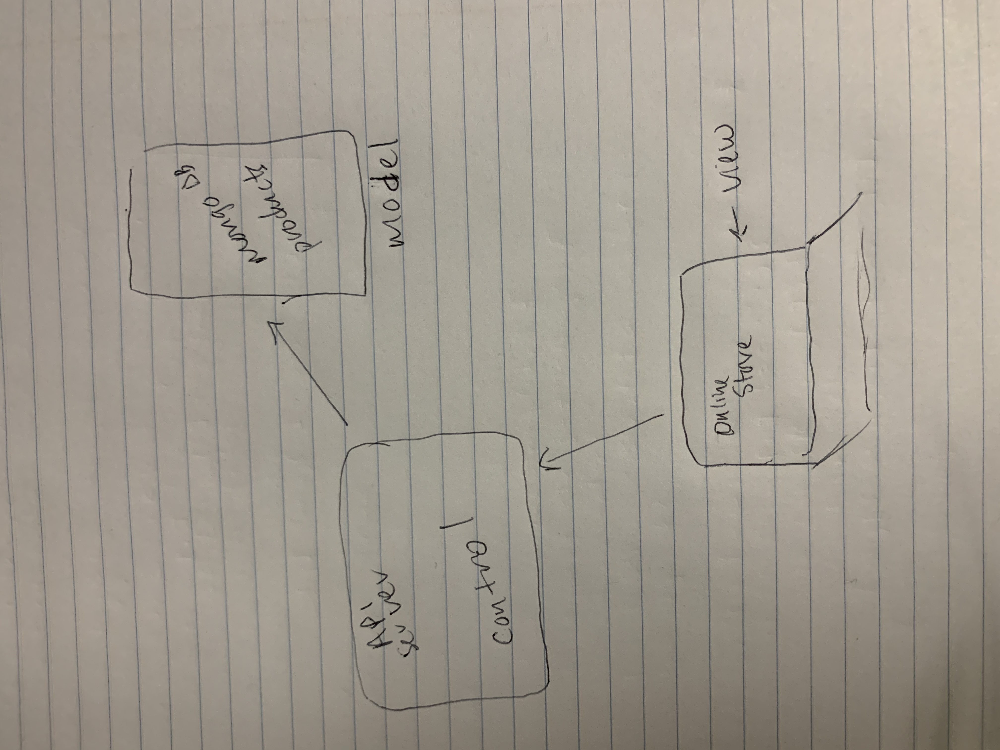

# Storefront

## Author: Sara Russert

## Description of Project
An online shopping portal for a fictional store

## Technical Requirements
React
ES6 Classes
Redux Store for Application State
Deployed API with Mongo storage for storing categories and products
Superagent or Axios for performing API Requests
Material UI for layout and styling
Test Driven Development, using Jest
Deployment to a cloud provider (Netlify, Amplify, or GitHub Pages)

## Installing Storefront
git clone https://github.com/401-advanced-javascript-sararussert/storefront.git
navagate to the inner todo folder and npm i

## Using Storefront
- npm start
- npm test

## Acknowledgments 
site built using instruction from:
https://www.udemy.com/course/mern-ecommerce/
for reference:
https://material-ui.com/
https://reactjs.org/

# UML
